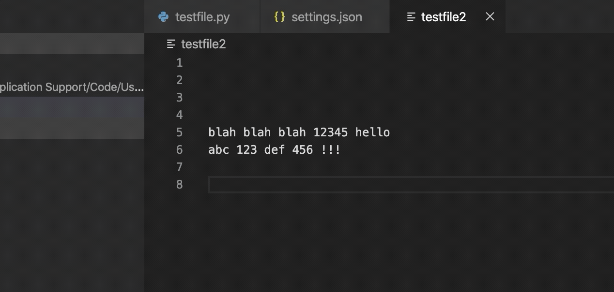

# regexp-saver

Visual Studio Code extension for saving and re-using regular expressions while coding.

## Features

Open the Command Palette (ctrl/cmd + shift + P) and start typing in "RegExp Saver" to see the commands available. The available commands are:

- Save new RegExp
- Find in File
- Find in Selection
- Replace in File
- Replace in Selection



## Extension Settings

To edit your extension settings open the Command Palette (ctrl/cmd + shift + P) and you can either
choose "Preferences: Open User Settings (JSON)" or "Preferences: Open Workspace Settings (JSON)".
[See the difference here.](https://code.visualstudio.com/docs/getstarted/settings)

This extension contributes the following settings:

`regExpSaver.saved`: save your regular expressions to re-use under this array. Each object in this array becomes an item you can pick to apply when using the RegExp Saver commands.

`regExpSaver.savedForWorkspace`: save your regular expressions to re-use for a specific workspace. These items won't show when selecting a RegExp in other workspaces.

Instead of manually editing the JSON, you can use the interface provided by the command "RegExp Saver: Save new RegExp" under the Command Palette (ctrl/cmd + shift + P). If you'd like to manually edit the JSON, see below for the options that each object can define.

### Object options

`label`:
A descriptive label for your regular expression. Will be shown in the menu
when picking which one to apply to your file or selection.

`regExp`:
The regular expression pattern.
IMPORTANT: backslashes need to be doubled up. Example: `\w` needs to be `\\w`.
Otherwise JSON will think `\w` is just `w`.
(This isn't a problem when using the command "RegExp Saver: Save new RegExp", just when manually editing the settings JSON)

`replacePattern`:
The replacement pattern for replacing characters matched by your `regExp` pattern.
Each capture group can be referenced like `$1`, `$2`, `$3`, etc.
Leave blank to delete everything your `regExp` matched.

`regExpFlags`:
A string of flags such as "g", "i", and "m". Unspecified defaults to "g".

### Examples

```json
{
  "regExpSaver.saved": [
    {
      "label": "Replace all Robs with Robert",
      "regExp": "rob",
      "replacePattern": "Robert",
      "regExpFlags": "gi"
    },
    {
      "label": "Format phone numbers",
      "regExp": "(\\d{3})(\\d{3})(\\d{4})",
      "replacePattern": "($1) $2-$3"
    }
  ]
}
```

## Thanks

Made during 10% time at Security Compass
